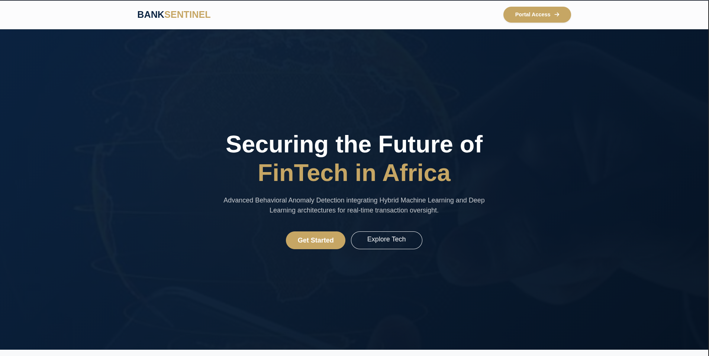
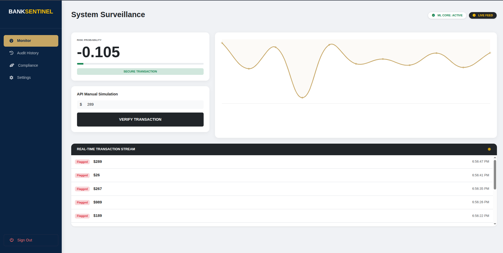
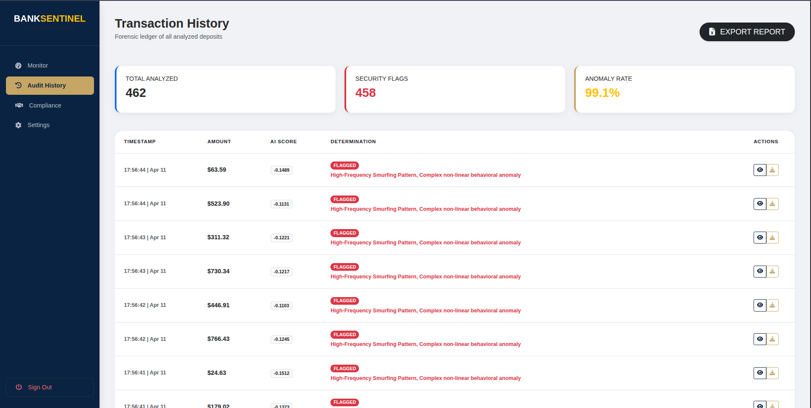
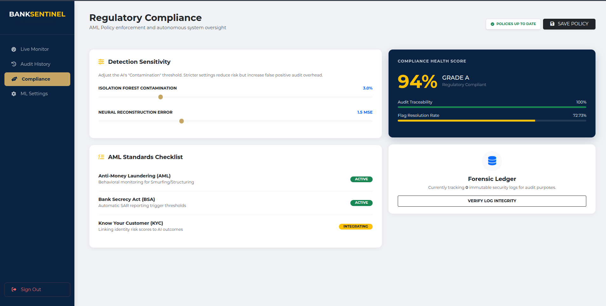

#  Bank Sentinel: `Hybrid AI Anomaly Detection System`

[](https://www.python.org/)
[](https://flask.palletsprojects.com/)
[](https://scikit-learn.org/)
[](https://github.com/40874/flask-talisman)
[](https://www.docker.com/)

**Bank Sentinel** is a production-grade financial security platform engineered for African FinTechs, SACCOs, and Banks. It integrates **Hybrid Machine Learning** and **Deep Learning** architectures to provide real-time identification, forensic auditing, and autonomous flagging of anomalous banking transactions.

## Project Goal
To implement a production-ready AI platform that leverages hybrid machine learning to automate the real-time detection, forensic auditing, and autonomous flagging of anomalous bank deposits, reducing operational risk and manual audit overhead.

## The Gap Solved
This system bridges the critical failure of static, threshold-based monitoring by identifying sophisticated behavioral fraud patterns—such as rapid smurfing, account takeovers, and non-linear irregularities—that bypass traditional banking rules.

## The Problem
Financial institutions across Africa face three critical security gaps:
1.  **Rule Rigidity:** Conventional systems fail to adapt to evolving fraud patterns without expensive manual reprogramming.
2.  **Delayed Intervention:** Manual audits often occur days after a suspicious event, making fund recovery impossible.
3.  **Context Blindness:** Standard checks look at transaction amounts in isolation, ignoring the **temporal frequency** and **behavioral fingerprints** of the account holder.


## Key Features

*   **Hybrid AI Core:** Dual-brain verification using **Isolation Forest** (Statistical Outliers) and **Neural Autoencoders** (Behavioral Reconstruction Error).
*   **Live Monitoring Dashboard:** Premium Glassmorphic UI featuring real-time risk trending via `Chart.js` and a live system activity feed.
*   **API-First Architecture:** RESTful endpoints (`/api/v1/detect`) designed for seamless integration with Core Banking Systems and Mobile Money Gateways (e.g., M-Pesa).
*   **Explainable AI (XAI):** Provides human-readable justifications for flags (e.g., *"High-Frequency Smurfing Pattern"* or *"Atypical Transaction Hour"*).
*   **Forensic Ledger:** A persistent audit trail with **Automated Excel Export** and **Digital Security Receipts** for every transaction.
*   **Production Security:** Integrated `Flask-Talisman` for CSP/HSTS protection and `Flask-Migrate` for schema versioning.
*   **Containerized Deployment:** Fully Dockerized for rapid deployment in high-availability cloud environments.


## Technical Stack

| Component | Technology |
| :--- | :--- |
| **Backend** | Python 3.13, Flask (Production-optimized via Gunicorn) |
| **Machine Learning** | Scikit-Learn (Isolation Forest), MLPRegressor (Autoencoder) |
| **Security** | Flask-Talisman (CSP/HSTS Headers), Werkzeug ProxyFix |
| **Database** | SQLite / SQLAlchemy (PostgreSQL/MySQL Ready) |
| **Deployment** | Docker, Docker Compose |
| **Frontend** | HTML5, CSS3 (Glassmorphism), Bootstrap 5, SweetAlert2, Chart.js |


##  System Preview

### 1. Public Landing Page
*Executive overview of the technical framework and value proposition.*


### 2. Live Monitor
*Real-time analysis center with live behavioral stream and risk trending.*


### 3. Audit History
*Searchable database of security flags with automated reasoning and receipt generation.*


### 4. Compliance Oversight
*Regulatory health scoring and AI sensitivity policy controls.*



## Installation & Setup

### 1. Virtual Environment
```bash
# Clone the repository
git clone https://github.com/yourusername/bank-anomaly-system.git
cd bank-anomaly-system

# Setup Environment
python3 -m venv venv
source venv/bin/activate
pip install -r requirements.txt

# Launch
python3 generate_data.py
python3 app.py
```

### 2. Docker Deployment
```bash
# Build and Launch the entire stack
docker compose up --build -d
```
*The app will be available at `http://localhost:8080`*

### 3. Live Traffic Simulation
To demonstrate the system's real-time detection capabilities, run the simulator:
```bash
python3 simulate_traffic.py
```

## Machine Learning Methodology
The system employs a **Hybrid Decision Logic**:
1.  **Isolation Forest (IF):** Detects statistical "Global Outliers" by measuring how easily a transaction is isolated in a decision tree.
2.  **Neural Autoencoder (AE):** A deep learning model that learns the "Identity" of normal behavior. Transactions that produce a high **Reconstruction Error (MSE)** are flagged as complex behavioral deviations that statistical rules would miss.


## Enterprise Integration
Bank Sentinel is designed as a **pluggable security module**:
*   **Credit Intelligence:** Anomaly scores feed into credit scoring models to identify high-risk borrowers before loan disbursement.
*   **Automated AML:** Replaces manual KYC/AML checks for SACCOs with an automated API-driven ledger.
*   **Scalability:** Horizontal scaling via Docker to handle 10,000+ transactions per second.


## License
Distributed under the MIT License. Developed by **ERIC NZYOKA**.
